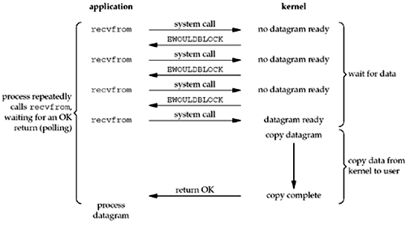
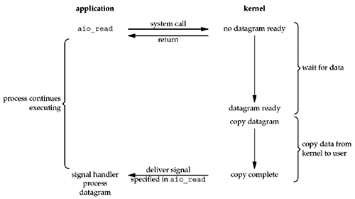

######1. Blocking I/O model.

######2. Nonblocking I/O model.

######3. I/O multiplexing model.

######4. Signal-Driven I/O model.

######5. Asynchronous I/O model.

######6. Comparison of the five I/O models.

