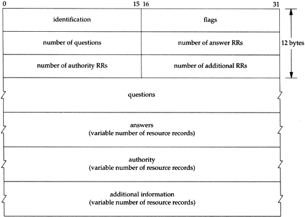

######General format of DNS queries and responses.

*When a resolver issues a query using TCP instead of UDP, section 4.2.2 of RFC 1035 specifies that a 2-byte length precedes the actual DNS message.*

